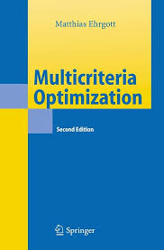

::: {.hero-split}

::: {.hero-text}

Decision makers in many areas, from industry to engineering and the social sector, face an increasing need to consider multiple, conflicting objectives in their decision processes. 
In many cases these real world decision problems can be formulated as multicriteria mathematical optimization models. 
The solution of such models requires appropriate techniques to compute so called efficient, or Pareto optimal, or compromise solutions that - unlike traditional mathematical programming methods - take the contradictory nature of the criteria into account. This book provides the necessary mathematical foundation of multicriteria optimization to solve nonlinear, linear and combinatorial problems with multiple criteria. Motivational examples illustrate the use of multicriteria optimization in practice. Numerous illustrations and exercises as well as an extensive bibliography are provided.

To help others undestand better the content of the book and summarized it so it can help to develop differente projects making approchable the knowledge of decision making.
:::

::: {.hero-image}

:::

::: 

## Chapters

::: {.chapter-grid}

::: {.chapter-card}
### 01
**Chapter 1**

Introduction

[See presentation →](capitulo-01/capitulo-01.qmd){.chapter-link}
:::

::: {.chapter-card}
### 02
**Chapter 2**

Efficency and Nondominance

[See presentation →](capitulo-02/capitulo-02.qmd){.chapter-link}
:::

::: {.chapter-card}
### 03
**Chapter 3**

The Weighted Sum Method and Related Topics

[See presentation →](capitulo-03/capitulo-03.qmd){.chapter-link}
:::

::: {.chapter-card}
### 04
**Chapter 4**

Scalarization Techniques

[See presentation →](capitulo-04/capitulo-04.qmd){.chapter-link}
:::

::: {.chapter-card}
### 05
**Chapter 5**

The Other Definitions of Optimatlity - Nonscalarizing Methos

[See presentation →](capitulo-05/capitulo-05.qmd){.chapter-link}
:::

::: {.chapter-card}
### 06
**Chapter 6**

The Weighted Sum Method and Related Topics

[See presentation →](capitulo-06/capitulo-06.qmd){.chapter-link}
:::

::: {.chapter-card}
### 07
**Chapter 7**

A Multiobjective Simple Method

[See presentation →](capitulo-07/capitulo-07.qmd){.chapter-link}
:::

::: 
<!-- Este cierra el .chapter-grid -->